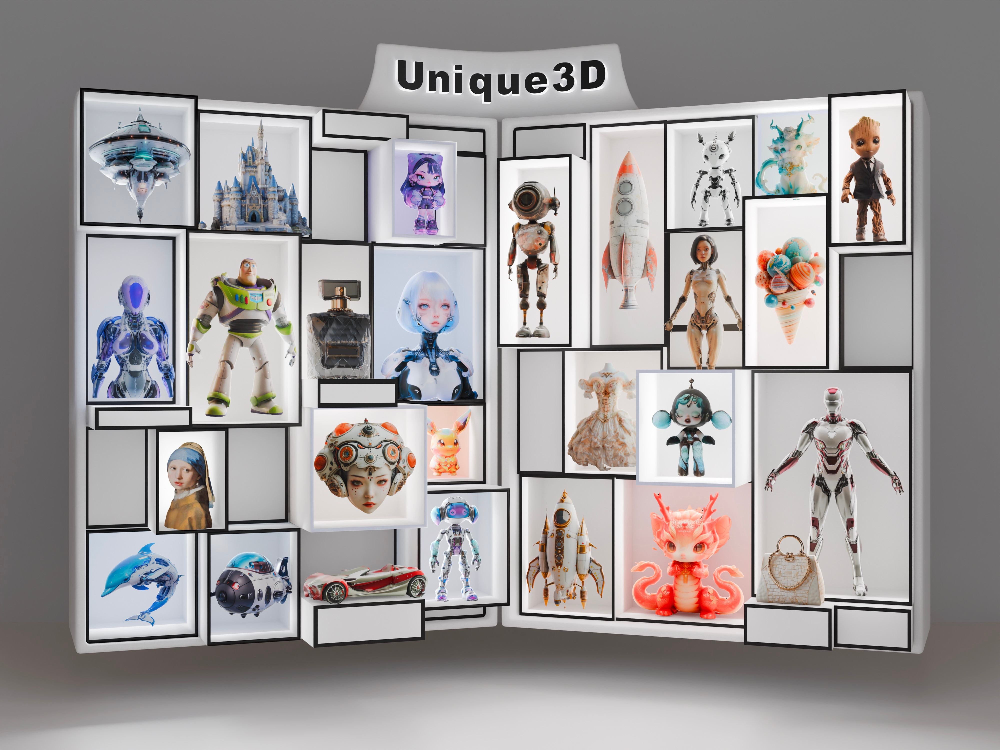

**其他语言版本 [English](README.md)**

# Unique3D
High-Quality and Efficient 3D Mesh Generation from a Single Image

[Kailu Wu](https://scholar.google.com/citations?user=VTU0gysAAAAJ&hl=zh-CN&oi=ao), [Fangfu Liu](https://liuff19.github.io/), Zhihan Cai, Runjie Yan, Hanyang Wang, Yating Hu, [Yueqi Duan](https://duanyueqi.github.io/), [Kaisheng Ma](https://group.iiis.tsinghua.edu.cn/~maks/)

## [论文](https://arxiv.org/abs/2405.20343) | [项目页面](https://wukailu.github.io/Unique3D/) | [Huggingface Demo](https://huggingface.co/spaces/Wuvin/Unique3D) | [Gradio Demo](https://u45213-bcf9-ef67553e.westx.seetacloud.com:8443/) | [在线演示](https://www.aiuni.ai/)


<p align="center">
    
</p>

Unique3D从单视图图像生成高保真度和多样化纹理的网格，在4090上大约需要30秒。

### 推理准备

#### Linux系统设置
```angular2html
conda create -n unique3d
conda activate unique3d
pip install -r requirements.txt
```

#### 交互式推理：运行您的本地gradio演示

1. 从 [huggingface spaces](https://huggingface.co/spaces/Wuvin/Unique3D/tree/main/ckpt) 下载或者从[清华云盘](https://cloud.tsinghua.edu.cn/d/319762ec478d46c8bdf7/)下载权重，并将其解压到`ckpt/*`。
```
Unique3D
    ├──ckpt
        ├── controlnet-tile/
        ├── image2normal/
        ├── img2mvimg/
        ├── realesrgan-x4.onnx
        └── v1-inference.yaml
```

2. 在本地运行交互式推理。
```bash
python app/gradio_local.py --port 7860
```

## 获取更好结果的提示

1. Unique3D对输入图像的朝向非常敏感。由于训练数据的分布，**正交正视图像**通常总是能带来良好的重建。对于人物而言，最好是 A-pose 或者 T-pose，因为目前训练数据很少含有其他类型姿态。
2. 有遮挡的图像会导致更差的重建，因为4个视图无法覆盖完整的对象。遮挡较少的图像会带来更好的结果。
3. 尽可能将高分辨率的图像用作输入。

## 致谢

我们借用了以下代码库的代码。非常感谢作者们分享他们的代码。
- [Stable Diffusion](https://github.com/CompVis/stable-diffusion) 
- [Wonder3d](https://github.com/xxlong0/Wonder3D) 
- [Zero123Plus](https://github.com/SUDO-AI-3D/zero123plus) 
- [Continues Remeshing](https://github.com/Profactor/continuous-remeshing) 
- [Depth from Normals](https://github.com/YertleTurtleGit/depth-from-normals) 

## 合作

我们使命是创建一个具有3D概念的4D生成模型。这只是我们的第一步，前方的道路仍然很长，但我们有信心。我们热情邀请您加入讨论，并探索任何形式的潜在合作。<span style="color:red">**如果您有兴趣联系或与我们合作，欢迎通过电子邮件(wkl22@mails.tsinghua.edu.cn)与我们联系**</span>。
